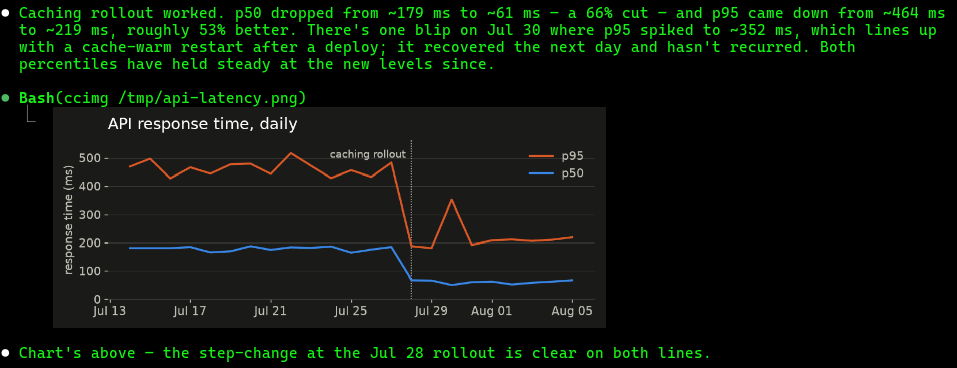

# ccimg

Render images inline in a Claude Code transcript.

<p align="center">
  
</p>

Claude Code's TUI can't display images — when Claude wants to show you a
chart, a screenshot, or an icon, the best it can normally do is print a file
path. `ccimg` fixes that: Claude runs `ccimg <image>` as an ordinary shell
command and (in a [supported terminal](#requirements)) the image appears
right in the conversation, scrolling with the transcript like any other tool
output.

```
ccimg [-v] [--direct] [--no-sweep] <image> [cols]
```

- `<image>` — any format Pillow can open (PNG, JPEG, GIF, WebP, ...)
- `[cols]` — optional width in terminal cells; default fits the terminal
  and the image's native size, whichever is smaller
- `-v` (or `CCIMG_DEBUG=1`) — print a diagnostic line (source size, cell
  geometry, image id, transmission medium, target pty)
- `--direct` (or `CCIMG_DIRECT=1`) — transmit the PNG in-band as chunked
  base64 instead of via temp file, for terminals without file-transmission
  support
- `--no-sweep` (or `CCIMG_NO_SWEEP=1`) — skip the repaint sweep that runs
  by default shortly after each render (`CCIMG_SWEEP_MS`, default 500): a
  detached one-column winsize jiggle that makes the TUI replay its output,
  clearing stray fragments an upstream Claude Code repaint bug
  ([#17519](https://github.com/anthropics/claude-code/issues/17519),
  [#84297](https://github.com/anthropics/claude-code/issues/84297))
  sometimes leaves near tall output

## Requirements

- A terminal implementing the kitty graphics protocol's
  [Unicode placeholders](https://sw.kovidgoyal.net/kitty/graphics-protocol/#unicode-placeholders)
  — verified in [ghostty](https://ghostty.org);
  [kitty](https://sw.kovidgoyal.net/kitty/) originated it
- Linux — the script resolves Claude's pty by walking `/proc`
- Python 3 with [Pillow](https://pypi.org/project/pillow/)
- A verbose Claude Code session — launch with `claude --verbose` (or set
  `"viewMode": "verbose"` in `settings.json`). Without it Claude Code
  collapses every tool result taller than 4 rows to 3 lines +
  "`… +N lines`", hiding the placeholder block the image renders from;
  `ctrl+o`'s transcript view is then the only way to see it

## Install

Drop the script somewhere on `PATH`:

```sh
curl -o ~/.local/bin/ccimg https://raw.githubusercontent.com/EugeneSusla/ccimg/main/ccimg
chmod +x ~/.local/bin/ccimg
```

Then tell Claude about it — e.g. in `CLAUDE.md`:

```markdown
**Show me images with `ccimg <file> [cols]`.** Renders inline in the
transcript. The render is user-side only — your copy of the output is
placeholder runes, not evidence of failure. Never pipe/filter ccimg
output; dropped rows crop the image.
```

## How it works

Getting pixels into a TUI whose renderer knows nothing about images takes
two tricks, one per direction:

1. **Pixels reach the terminal behind the TUI's back.** The script finds
   the Claude Code process by walking `/proc` ancestry, reads its stdin
   pty, and hands the (downscaled) PNG to the terminal via a kitty
   graphics APC escape written to that pty — invisible and cursor-neutral,
   in quiet mode (`q=2`) so terminal responses don't land in Claude's
   stdin. By default the PNG travels as a temp file
   (`/tmp/tty-graphics-protocol-*`, deleted by the terminal after
   reading), so the pty carries only one small atomic escape rather than
   hundreds of KB of base64 racing the TUI's own concurrent writes;
   `--direct` / `CCIMG_DIRECT=1` switches back to chunked in-band
   transmission for terminals without file support.
2. **Placement travels through the TUI as plain text.** What `ccimg`
   prints to stdout — the part Claude Code captures as tool output — is a
   block of `U+10EEEE` placeholder characters with row/column combining
   diacritics, foreground-colored with the image id. To the TUI it's
   ordinary styled text, so it scrolls and redraws like text — but the
   terminal paints the matching image tile in each such cell (a "virtual
   placement", `U=1`).

Details the script takes care of:

- Claude Code hard-wraps tool-result lines at terminal width minus a
  margin, measured with `Bun.stringWidth` — which, unlike a terminal,
  counts most of the kitty diacritics as width 1. A wrapped placeholder
  line tears the image grid, so the column count is capped against the
  *measured* width via a per-diacritic width table.
- The pty is re-resolved on every call, never cached: a restarted Claude
  process's old pty can be recycled to a different terminal window.
- EXIF orientation is applied; images are downscaled to the placement but
  never upscaled past native size; the image id is a content+geometry
  hash, so re-showing the same file reuses its id.

## Limitations

- The image renders only in the live terminal. Claude's copy of the tool
  result is stripped escape codes plus placeholder runes; scrollback
  copy/paste yields the same. A screenshot is the only durable record.
- Shrinking the terminal window after a render re-wraps old lines and
  tears past images — no width margin can prevent that.
- Image ids are 3 bytes of a content hash; after thousands of distinct
  images in one terminal session, a collision can repaint an older
  placeholder.

## Attribution

The row/column diacritics table is generated data from
[kitty](https://github.com/kovidgoyal/kitty)'s
`gen/rowcolumn-diacritics.txt` (a plain Unicode codepoint list, part of
the graphics protocol spec).

## License

[MIT](LICENSE)
